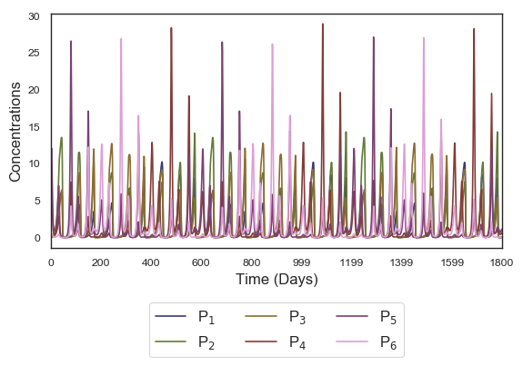

## PHYRE



### What is PHYRE?

It is a PHYtoplankton-REsource (and Zooplankton) model for Python designed to simulate 
a mix of competitive dynamics between species and predator-prey interactions.

### How do you use it?

The `phyre` package contains all the classes/modules you need, in combination with the scripts in the `src` directory.

There are two categories of simulations:

1. **Single**: Run one simulation, setting all parameter values in advance.
1. **Sweep**: Run a series of simulations while varying one or more parameter. Useful for studying how model output depends on said parameters.

See the examples and examine the output to get a sense of how the model works.

#### Installation

To install the requirements for `phyre`, use

```bash
pip install -r requirements.txt
```

You can import the `phyre` package and its modules from anywhere by including this
 at the top of your Python script:

```python
import sys
sys.path.append('/path/to/phyre/package')
```

### Directory Structure

<pre class="language-bash"><code class="language-bash">phyre
|____plots
| |____single_example_debug.pdf             # output: plot_single_example_debug.py
| |____single_example.pdf                   # output: plot_single_example.py
| |____single_example_noise.pdf             # output: plot_single_example_noise.py
| |____single_example.png                   # Same as single_example.pdf, for display in this README.md file
| |____single_example_multiplot.pdf         # output: plot_single_example_multiplot.py

|____plot_debug_example.py                  # plot RHS terms output from single example run
|____plot_single_example_multiplot.py
|____plot_sweep_example.py                  # plot output of example sweep of runs
|____plot_single_example.py                 # plot output of example single run 
|____plot_single_example_noise.py           # plot output of example single run that has noise
|____plot_time_series_sweep.py              # plot individual time series from sweep run

|____requirements.txt                       # install required libraries
|____README.md
|____.gitignore

|____apply_functions_example.py             # apply functions to sweep output from stored time series
|____run_hpc.py                             # use to run (already-configured) sweep


|____sweep_example.py                       # configure example sweep run and store params
|____single_example.py                      # configure + execute example single model run
|____single_example_noise.py                # configure + execute example single model run with noise

|____phyre                                  # phyre package
| |____analysis     
| | |____analysis.py                        # module with functions for analyzing model output
| | |____plot_single.py                     # class for plotting model output

| |____ts_funs.py                           # functions to apply to model output during sweeps 
                                            # see run_hpc.py and apply_functions.py 

| |____constants.py                         # commonly-used constant values
| |____components
| | |____bio.py                             # the heart of the model! 
| | |____integration.py                     # integrates individual model run over specified time
| |____local_constants.py                   # user-specific constants (e.g. for sending sweeps to HPC)
| |____model
| | |____single.py                          # model setup for single runs
| | |____sweep.py                           # model setup for sweep runs

| |____helpers.py                           # lots of helper functions
</code></pre>

### Credits

Thanks to Inès Mangolte and Quentin Jutard of [L'OCEAN](http://www.access-eu.org/en/partners/description_partners.html) for their input. 
Inès developed a feature to add filtered Gaussian noise to the turnover rate. 
Quentin helped implement a more realistic grazing parameterization. 
Both discovered many a bug.